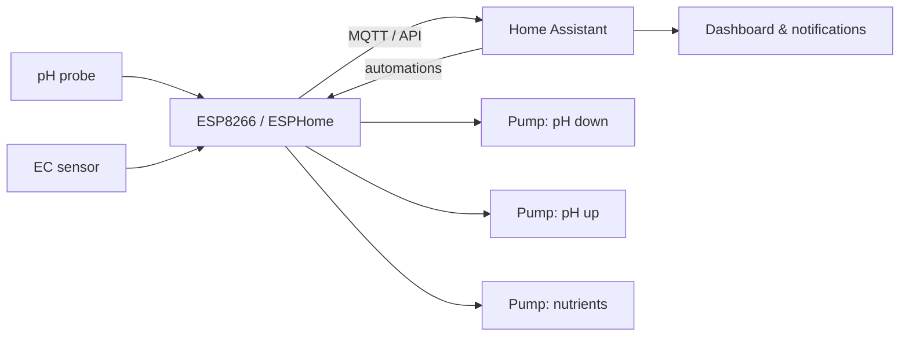

# Architecture

Chaac is split into two subsystems.

## 1. Fluid handling

| Function | Part |
|---|---|
| Power input | 120 V wall outlet (type A) → 12 V / 24 W switching power supply |
| Motion + dosing | 3 × 12 V DC peristaltic pumps (≤ 5 W each) |
| Tubing | Silicone tubing, 3 mm inner diameter |
| Additive storage | Polyethylene bottles or tanks |

Peristaltic pumps were chosen because the liquid never touches moving parts. That means no contamination (important for food crops), a long pump life and accurate flow.

## 2. Measurement and control

| Function | Part |
|---|---|
| pH sensing | Analog pH probe + signal board |
| EC sensing | EC sensor |
| Controller | ESP8266 running ESPHome (an ESP32 also works) |
| Connectivity | Wi-Fi → MQTT → Home Assistant on a Raspberry Pi |

## Data flow

The ESP8266 reads and filters the sensors. Home Assistant stores the data, shows it on the dashboard, and runs the control logic (low pH, high pH, low EC) that switches the pumps.
